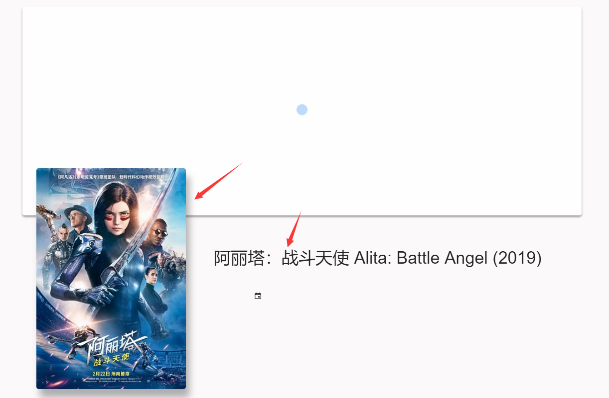
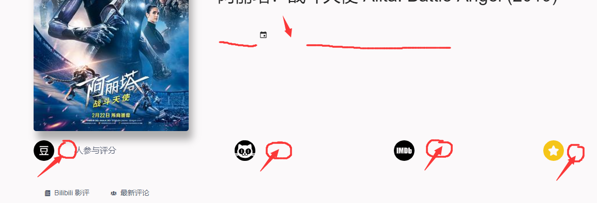
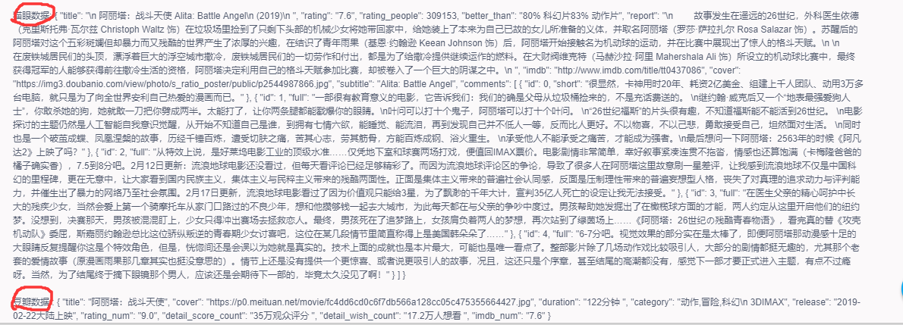
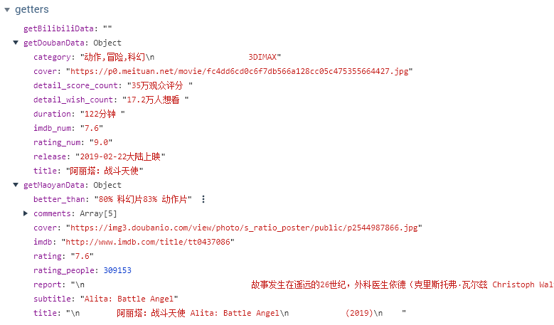

# movie-dash

## BUG

Some data from VUEX can show up 



Some just don’t



But if I use `{{somedata}}` to reveal this data:



Surely I’ll get some thing....

getters got data 



*Where I was missing ?*

## Project setup

```
npm install
```

### Compiles and hot-reloads for development
```
npm run electron:serve
```

### Compiles and minifies for production
```
npm run electron:build
```

### Run your tests
```
npm run test
```

### Lints and fixes files
```
npm run lint
```

### Customize configuration
See [Configuration Reference](https://cli.vuejs.org/config/).
