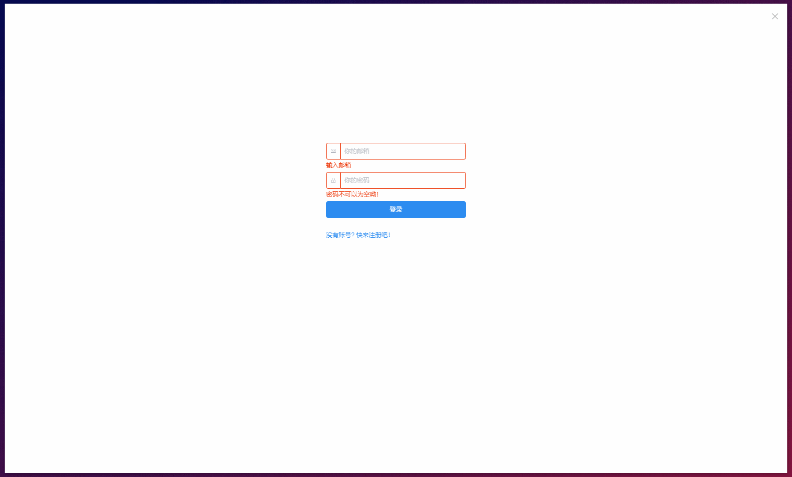

# 跨平台电影聚合系统

### 运行你的项目

启动后端服务器

```
cd backend
nodemon
```


启动前端服务

```
cd movie-dash
npm run electron:serve
```


打包你的程序

```
npm run electron:build
```


### demos

1. 登录



2. 即将上映


3. 查询电影


4. 推荐

